# Intellij 用gradle搭建Spring+Hibernate+Struts2

项目源码例子:
https://github.com/JonasHao/SSH-User-Signup

准备：
Intellij + JDK 8 + Tomcat 9

# 新建项目
File -> New -> Project

左侧选择Gradle,
Project SDK配置成JDK的目录。
Additional Libraries and Frameworks中勾选Java和Web，点击Next
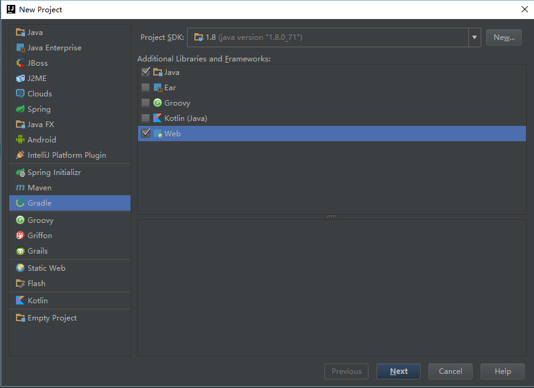

进入gradle配置页面，groupID填写组织域名。
ArtifectId填写项目的名称。点击Next-Next
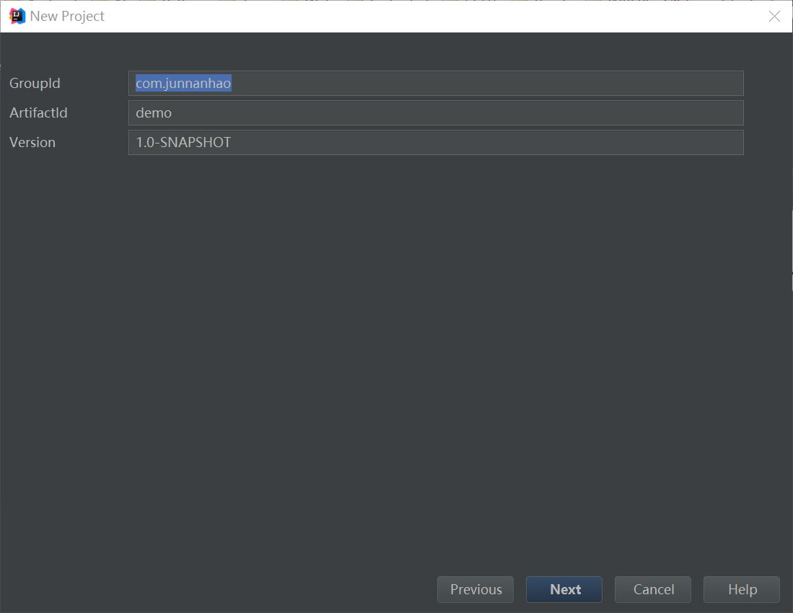

选择项目目录，然后Finish。

# 配置Gradle文件
第一次打开项目，可能会需要一段时间更新gradle版本，请耐心等候完成。
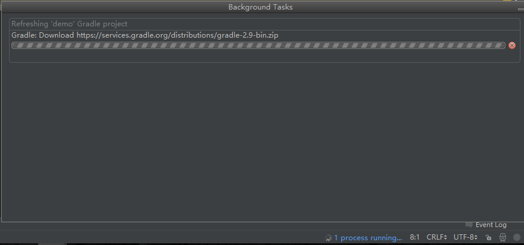

更新gradle完成之后，修改 `build.gradle`，
这是我的，包含了spring、java ee、 struts2 、 hibernate、 jdbc的依赖：

```gradle
group 'com.junnanhao'
version '1.0-SNAPSHOT'

apply plugin: 'java'
apply plugin: 'spring-boot'

sourceCompatibility = 1.8
targetCompatibility = 1.8


repositories {
    mavenCentral()
}


buildscript {
    ext {
        springBootVersion = '1.3.3.RELEASE'
    }
    repositories {
        mavenCentral()
    }
    dependencies {
        classpath("org.springframework.boot:spring-boot-gradle-plugin:${springBootVersion}")
    }
}


dependencies {
    // 将libs 文件夹中的jar 全部打包进工程
    compile fileTree(dir: 'libs', include: ['*.jar'])

    testCompile group: 'junit', name: 'junit', version: '4.11'

    // spring
    testCompile('org.springframework.boot:spring-boot-starter-test')
    compile("org.springframework.boot:spring-boot-starter-web")
    compile('org.springframework.boot:spring-boot-starter')
    compile('org.springframework:spring-orm')

    // compile java ee 7
    compile('javax:javaee-api:7.0')

    // struts
    compile('org.apache.struts:struts2-core:2.3.28')
    compile('org.apache.struts:struts2-spring-plugin:2.3.28')
    compile('org.apache.struts:struts2-convention-plugin:2.3.28')

    // hibernate
    compile ('org.hibernate:hibernate-core:5.1.0.Final')

    // jdbc
    compile('mysql:mysql-connector-java:5.1.6')

}

```
Refresh gradle, Intellij会自动检测到gradle内容的变动，并询问是否要refresh,
如果没有检测到，点击窗口右侧的gradle, 一个回收的标志就是 Refresh，如图：

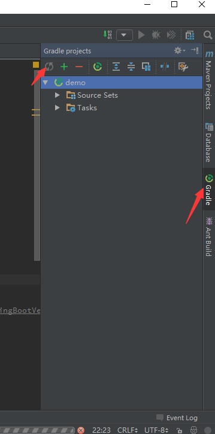

此时，Intllij自动从maven下载缺失的依赖项。
这将是漫长的过程，因为要下载Spring、Struts2、Hibernate以及 Java ee的库文件 (如果之前没有下载过的话）。

# 配置项目
至此，我们已经为项目做好了充分准备，所有sdk都已就绪，现在开始配置项目的框架。

## 添加SSH框架
在demo/src/main上点击鼠标右键，点击Add Framework Support:
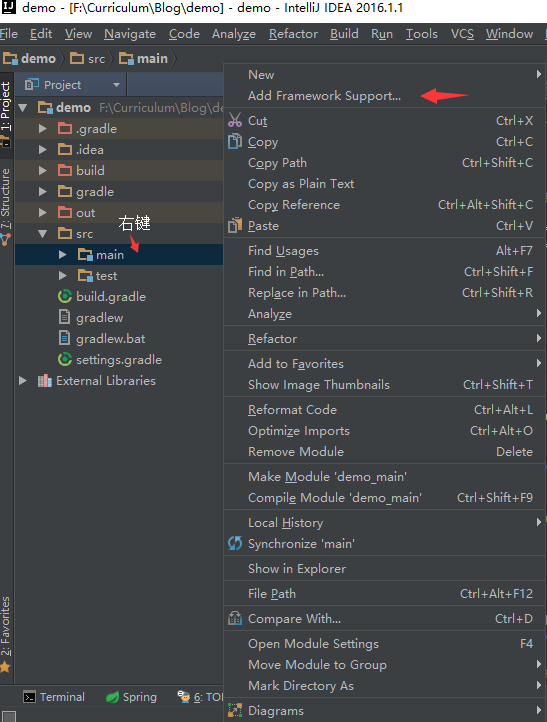

在左侧依次选择Struts2、 Spring MVC 和 Hibernate：
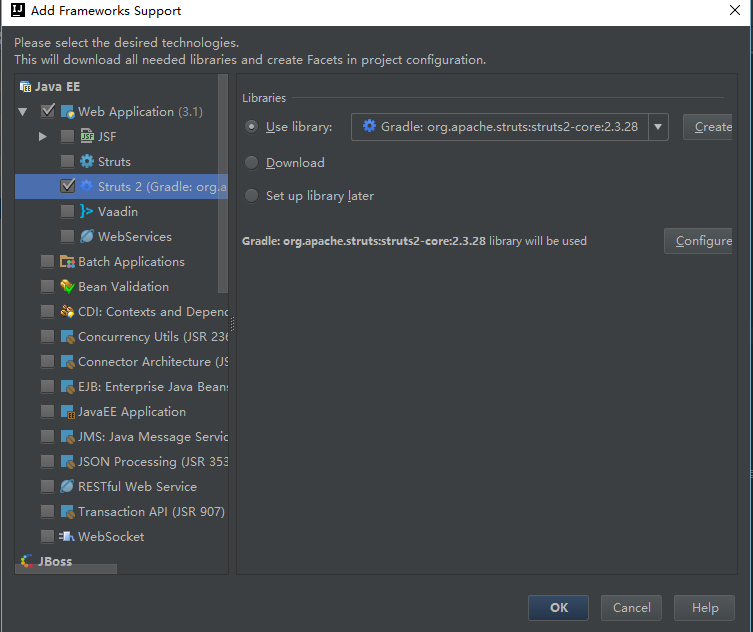


此时Intellij会检测到新的框架，并提醒配置。
我们不需要修改默认配置，不过可以点进去看一看。
如果没有提醒也没关系，在File -> Project Settings（快捷键：`Ctrl+Alt+Shift+S`)
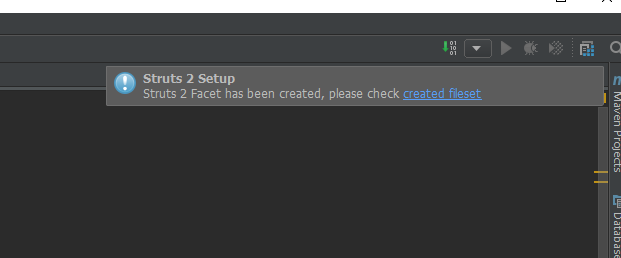

现在的目录是这样子的：

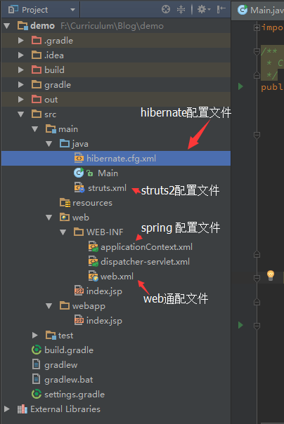

默认的配置都已经是OK的了, 唯一要做的是将Hibernate集成到Spring中。

首先配置`hibernate.cfg.xml`:
根据你的电脑的情况设置以下项:
- connection.url
- connection.driver_class
- connection.username
- connection.password
- dialect
- current_session_context_class

下面是我的配置,可供参考。
```xml
<?xml version='1.0' encoding='utf-8'?>
<!DOCTYPE hibernate-configuration PUBLIC
        "-//Hibernate/Hibernate Configuration DTD//EN"
        "http://www.hibernate.org/dtd/hibernate-configuration-3.0.dtd">

<hibernate-configuration>
    <session-factory>
        <!-- Database connection settings -->
        <property name="connection.driver_class">com.mysql.jdbc.Driver</property>
        <property name="connection.url">jdbc:mysql://localhost:3306/demo</property>
        <property name="connection.username">******</property>
        <property name="connection.password">******</property>

        <!-- JDBC connection pool (use the built-in) -->
        <property name="connection.pool_size">10</property>

        <!-- SQL dialect -->
        <property name="dialect">org.hibernate.dialect.MySQLDialect</property>

        <!-- Enable Hibernate's automatic session context management -->
        <property name="current_session_context_class">thread</property>

        <!-- Echo all executed SQL to stdout -->
        <property name="show_sql">true</property>
        <property name="format_sql">true</property>

        <!-- Drop and re-create the database schema on startup -->
        <property name="hbm2ddl.auto">update</property>

    </session-factory>
</hibernate-configuration>
```
在Spring的配置文件`applicationContext.xml`中加入sessionFactory这一bean.
这样Spring会为所有依赖于id为sessionFactory的bean注入依赖 （通过调用那些类的`setSessionFactory() `方法。）
```xml
 <bean id="sessionFactory" class="org.springframework.orm.hibernate5.LocalSessionFactoryBean">
        <property name="configLocations" value="classpath:hibernate.cfg.xml"/>
 </bean>
```

重启一下项目，新打开时，Intellij会提醒检测到Hibernate的数据源，点击Discover and setup：
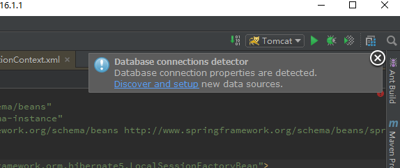


## 配置Tomcat服务器
1. Edit Configurations


2. Add new configuration - tomcat server - Local
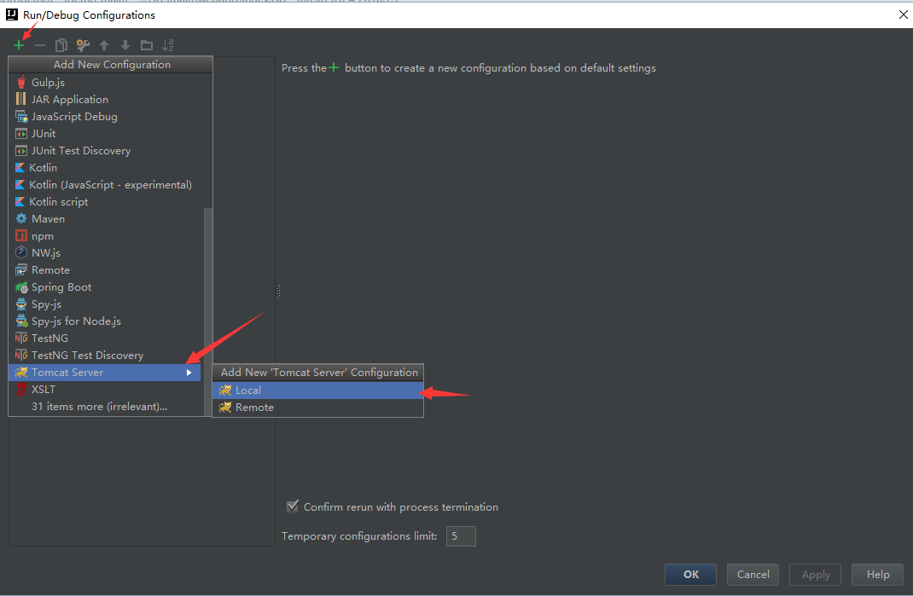

3. Configure Application server， 选择Tomcat SDK Home目录


4. Deployment - 点击加号 - Artifact - 选择默认的Artifact


5. 点击铅笔的图标， 编辑Artifact（也可以在Project Settings的右侧找到Artifact)
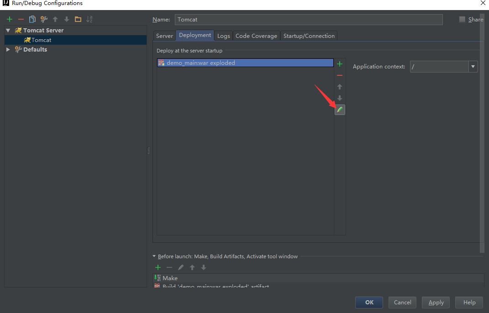

6. 将demo_main模块添加到artifact, 做法是：右键在demo_main上，点击Put into Ouput Root。 demo是我的项目名字。


7. 添加xml文件到artifact，hibernate.cfg.xml和struts.xml（所有xml文件都）默认情况不会被自动添加到build结果中，需要手动配置：
点击加号 - File, 选择两个xml文件
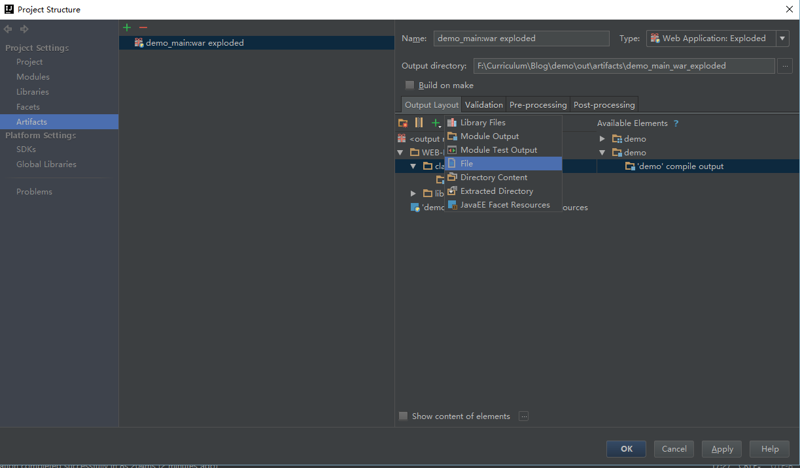


OK!

现在，整个配置都已经完成了。
点击tomcat猫旁边的绿色三角形运行一下！


看到这样的结果：

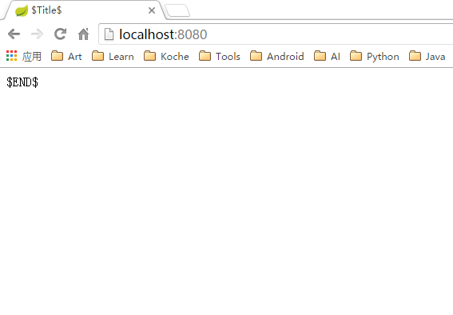

就说明tomcat配置成功了，这是index.jsp的页面，默认的欢迎页。


下面是一个用户注册的例子。

# 用户注册的例子
## 需求分析
网页上有一个表单，用户可以填入ID、密码、重复输入的密码、手机号码和邮箱，其中只有邮箱是选填的。
后台先校验数据，校验失败给用户相应的提醒，校验成功之后查询数据库，判断这个ID是否已经被注册，如果没有则创建一个用户，并永久保存到数据库中，否则提示用户这个ID已经被占用。

## 自顶向下设计
### 1. signUp.jsp
注册信息的表单，提交之后指向`SignUpAction`

### 2. UserAction.java
因为除了注册，用户还需要登录，我们将登录注册的action都放在UserAction.java中，只需在`struts.xml`中为每个action指定各自的方法。

SignUpAction指向UserAction中的`public String signUp()`方法。
在`signUp()`中，先做表单校验：
用户名的长度、包含字符，密码的长度、特殊字符，两次输入密码是否一致，手机号码格式以及邮箱格式。
记录校验不通过的字段以及原因，为之后提醒用户。

校验成功之后通过UserDao根据ID查询用户，查到用户不为空则表示ID被占用，查询为空则创建一个User对象，并通过UserDao保存User到数据库。

### 3. UserDao.java
暂时需要实现两个方法：
`User findUserByID(String ID)`
`void addUser(User user)`

## 自底向上实现
首先在demo/src/main/java 下创建几个包：
- /action
- /dao
- /po
- /service

### User.java
在/po下创建一个POJO（Pure Old Java Object)类：User.java.
```java
public class User {
    private String ID;
    private String phone;
    private String email;
    private long password;
}
```
然后充分利用Intellij的便捷。鼠标在password;后点一下，让焦点在User类内。
按快捷键`Alt + Insert`,或者鼠标右键-Generate...

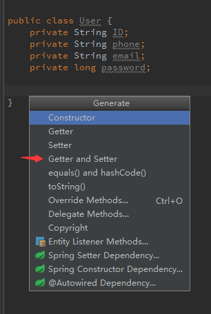

点Getter and Setter，然后全选，点击OK。

再用`Alt + Insert`，点Constructor，分别创建一个没有参数的构造函数和一个传入ID、密码、手机号的构造函数（邮箱在这里是选填的）。

接下来将User类标记为Hibernate的实体（@Entity),

并在getID()上标记ID为实体User的主键（@Id)

最后，User.java是这样：
```java
package po;

import javax.persistence.Entity;
import javax.persistence.Id;

@Entity
public class User {
    private String ID;
    private String phone;
    private String email;
    private long password;

    public User(String ID, String phone, long password) {
        this.ID = ID;
        this.phone = phone;
        this.password = password;
    }

    public User() {
    }

    @Id
    public String getID() {
        return ID;
    }

    public void setID(String ID) {
        this.ID = ID;
    }

    public String getPhone() {
        return phone;
    }

    public void setPhone(String phone) {
        this.phone = phone;
    }

    public String getEmail() {
        return email;
    }

    public void setEmail(String email) {
        this.email = email;
    }

    public long getPassword() {
        return password;
    }

    public void setPassword(long password) {
        this.password = password;
    }
}
```

更多标记请参考[Hibernate官方文档](http://docs.jboss.org/hibernate/orm/5.1/quickstart/html_single/#tutorial_annotations)

写完User.java之后，把它配置到`Hibernate.cfg.xml`中。
```xml
 <session-factory>
        ...
        <mapping class="po.User"/>
 </session-factory>
```

### UserDao.java
用Hibernate的sessionFactory创建一次会话，创建方式有两种
1. `sessionFactory.openSession();`
2. `sessionFactory.getCurrentSession()`

第一种创建了一个新的会话，需要手动flush、commit transaction、 close session.
适合于每次请求一次会话的情况。

第二种获取当前线程的会话，不需要手动关闭，会被自动处理。
适合于长会话。

这里用到了Hibernate Query Language， 跟Sql十分相像，但注意From子句后跟的不是表名，而是对应实体类的名字。
更多有关HQL请参考[Hibernate - Query Language](http://www.tutorialspoint.com/hibernate/hibernate_query_language.htm)。
```java
package dao;

import org.hibernate.Session;
import org.hibernate.SessionFactory;
import org.hibernate.Transaction;
import po.User;

import java.util.List;


public class UserDao{

    private SessionFactory sessionFactory;
    
    public String addUser(User user) {
        Session session = sessionFactory.openSession();
        Transaction transaction = session.beginTransaction();
        session.save(user);
        transaction.commit();
        session.flush();
        session.close();
        return "ok";
    }

    public User findUserByID(String ID) {
        sessionFactory.getCurrentSession().beginTransaction();

        List list = sessionFactory.getCurrentSession().
                createQuery("from User where ID = ?").
                setParameter(0, ID).list();

        if (list.size()>0) {
            Object object = list.get(0);
            System.out.println(object);
            return (User) object;
        }

        return null;
    }
    

    public void setSessionFactory(SessionFactory sessionFactory) {
        this.sessionFactory = sessionFactory;
    }
}

```
查询数据用到`sessionFactory`，它是从哪里获取的呢？

Spring在这里发挥作用了，它帮助我们注入这些依赖，只需要告诉Spring：UserDao要用到sessionFactory，那么Spring会在初始化的时候，为所有用到sessionFactory的类通过`setSessionFactory()`注入sessionFactory的一个实例。

做法也很简单，用Intellij的Generate（`ALT + Insert`)-Spring Setter Dependency
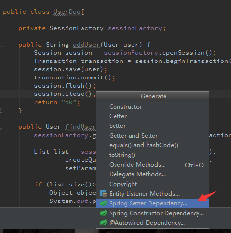

选择sessionFactory.（没错，这就是我们在整合Hibernate进Spring的时候创建的bean)


以上Generate的过程，相当于Intellij帮我们在`applicationContext.xml`中加入了一个bean：

```xml
<?xml version="1.0" encoding="UTF-8"?>
<beans xmlns="http://www.springframework.org/schema/beans"
       xmlns:xsi="http://www.w3.org/2001/XMLSchema-instance"
       xsi:schemaLocation="http://www.springframework.org/schema/beans http://www.springframework.org/schema/beans/spring-beans.xsd">

    <!--将Hibernate整合进Spring-->
    <bean id="sessionFactory" class="org.springframework.orm.hibernate5.LocalSessionFactoryBean">
        <property name="configLocations" value="classpath:hibernate.cfg.xml"/>
    </bean>
    
    <!--以下是Generate自动生成的代码-->
    <bean class="dao.UserDao" id="userDao">
        <property name="sessionFactory" ref="sessionFactory"/>
    </bean>
    
</beans>
```

### UserAction.java
代码的主要结构：
```java
package action;

import dao.UserDao;
import org.apache.struts2.dispatcher.DefaultActionSupport;


public class UserAction extends DefaultActionSupport {

    
    private String username;
    private String password;
    private String passwordAgain;
    private String phone;
    private String email;

    private UserDao userDao;

    UserAction() {
    }

  
    public String singUp() throws Exception {
        return INPUT;
    }


    /**
     * 校验用户名
     */
    private boolean validateUsername() {
        return false;
    }

    /**
     * 校验密码，只能包含数字、字母、下划线、符号，长度为6-20位
     */
    private boolean validatePassword() {
        return false;
    }
    
}
```

然后用Generate(`Alt + Insert`)生成Getter 和 Setter, 以及userDao的Spring Setter Dependency.

getter和setter函数使Action与jsp直接交互数据，也就是说，jsp表单里的表单项与一个私有成员（ID,password,phone,email)绑定之后，会自动调用setter方法。

Spring Setter 为我们注入UserDao。

这是一份完整的UserAction.java代码
```java
package action;

import dao.UserDao;
import org.apache.struts2.dispatcher.DefaultActionSupport;
import po.User;


public class UserAction extends DefaultActionSupport {

    
    private String username;
    private String password;
    private String passwordAgain;
    private String phone;
    private String email;

    private UserDao userDao;

    UserAction() {
    }

  
    public String singUp() throws Exception {
        if (validateUsername() && validatePassword()) {

            if (!password.equals(passwordAgain)) {
                addFieldError("passwordAgain", "两次密码输入不一致");
            }

            User user = userDao.findUserByID(username);
            if (user != null) {
                addFieldError("username", "用户名已经被占用");
                return INPUT;
            }

            user = new User(phone,username, password.hashCode());

            userDao.addUser(user);
            return SUCCESS;

        }
        return INPUT;
    }


    /**
     * 校验用户名
     */
    private boolean validateUsername() {
        if (username != null && username.matches("^[a-z0-9_-]{3,15}$")) {
            return true;
        }
        addFieldError("username", "用户名不符合规范");
        return false;
    }

    /**
     * 校验密码，只能包含数字、字母、下划线、符号，长度为6-20位
     */
    private boolean validatePassword() {
        if (!password.isEmpty() && password.matches("[0-9a-zA-Z!@#$%^?,./]{6,20}")) {
            return true;
        }
        addFieldError("password", "密码不符合规范");
        return false;
    }


    public String getUsername() {
        return username;
    }

    public void setUsername(String username) {
        this.username = username;
    }

    public String getPassword() {
        return password;
    }

    public void setPassword(String password) {
        this.password = password;
    }

    public String getPasswordAgain() {
        return passwordAgain;
    }

    public void setPasswordAgain(String passwordAgain) {
        this.passwordAgain = passwordAgain;
    }

    public String getPhone() {
        return phone;
    }

    public void setPhone(String phone) {
        this.phone = phone;
    }

    public String getEmail() {
        return email;
    }

    public void setEmail(String email) {
        this.email = email;
    }

    public void setUserDao(UserDao userDao) {
        this.userDao = userDao;
    }
}

```
>`addFieldError(feildName, errorMessage)`
> 记录的错误信息，将会在返回结果为INPUT之后，呈现在jsp中，效果如图：

> 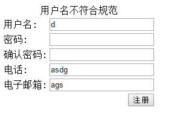

### struts.xml
接下来，我们在struts.xml中注册UserAction:
```xml
<?xml version="1.0" encoding="UTF-8"?>

<!DOCTYPE struts PUBLIC
        "-//Apache Software Foundation//DTD Struts Configuration 2.3//EN"
        "http://struts.apache.org/dtds/struts-2.3.dtd">
<struts>
    <package name="default" namespace="/" extends="struts-default">
        
        <action name="signUp" class="action.UserAction" method="singUp">
            <result name="input">index.jsp</result>
            <result name="success">welcome.jsp </result>
        </action>
        
    </package>
</struts>
```

### index.jsp
最后在jsp中添加一个表单，（index.jsp是默认的欢迎页。）

不要忘了在头部引入struts的标签库，

``` html
<%@ taglib prefix="s" uri="/struts-tags" %>

 <s:form action="signUp" validate="true" >
    <s:textfield name="username" label="用户名" maxLength="20" required="true"/>
    <s:password name="password" label="密码" maxLength="16" required="true"/>
    <s:password name="passwordAgain" label="确认密码" maxLength="16" required="true"/>
    <s:textfield name="phone" label="电话" maxLength="15" required="true"/>
    <s:textfield name="email" label="电子邮箱"/>

    <s:submit value="注册"/>
  </s:form>  
  
  ```
`name`属性绑定action的一个私有成员，提交表单之后将自动调用对应setter函数。

### welcome.jsp
新建一个jsp页面，注册成功后将跳转到这个页面。

最后，运行Tomcat：

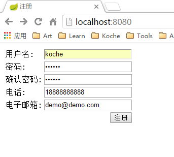

填写表单之后：
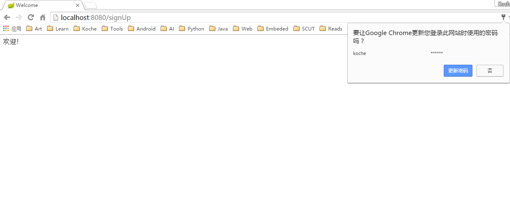

刷新一下数据库，可以看到新的记录已经插入：


至此，简单的用户注册的例子已经完成，欢迎大家指正提建议。

项目源码例子:
https://github.com/JonasHao/SSH-User-Signup